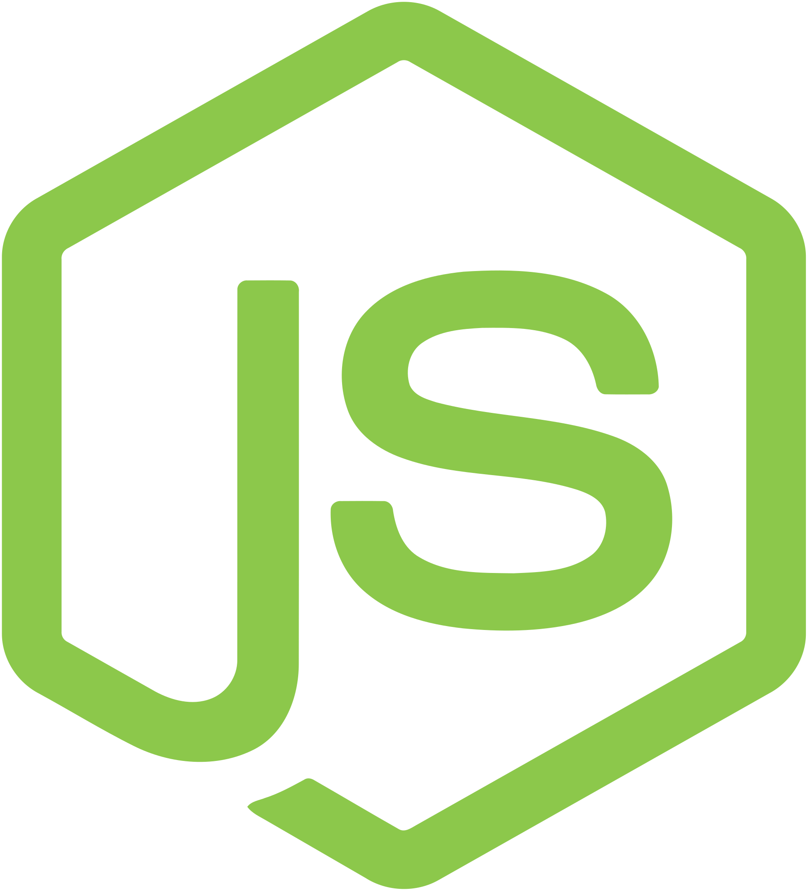
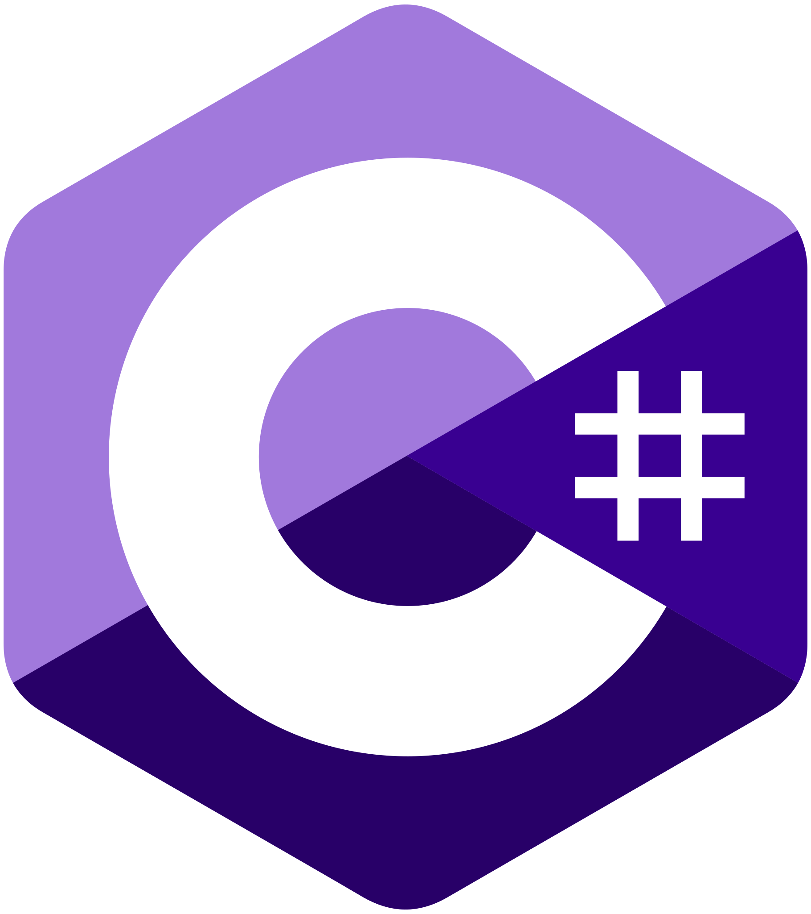
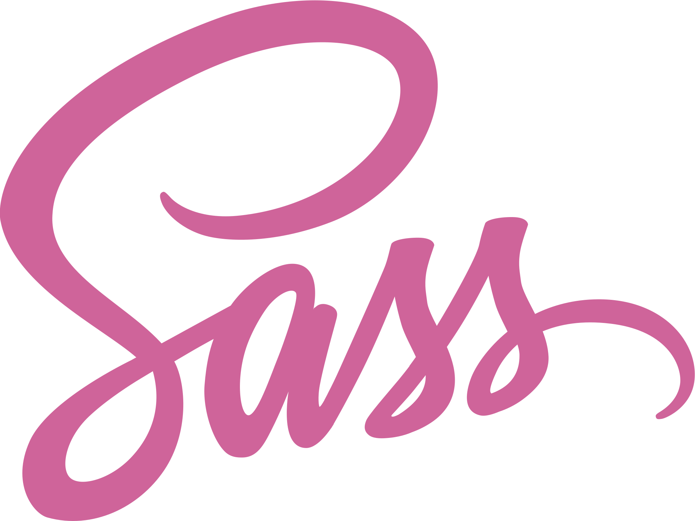

# 👩‍💻 Beatriz Ceschini

### Fullstack Developer focused on ERP & Backend | Systems Analyst | Passionate about technology, processes, and making a positive impact

### Desenvolvedora Fullstack focada em ERP & Backend | Analista de Sistemas | Apaixonada por tecnologia, processos e impacto positivo

I am a professional with experience working as a Systems Analyst at a major agro-industrial cooperative. I have hands-on experience with agile methodologies (Scrum), with a primary focus on backend development and corporate ERP maintenance.
Sou uma profissional com experiência atuando como Analista de Sistemas em uma grande cooperativa agroindustrial. Tenho experiência prática com metodologias ágeis (Scrum), com foco principal no desenvolvimento backend e manutenção de ERP corporativo.

---

### 🚀 About Me / Sobre Mim

* 💼 Working as a **Systems Analyst** focusing on **LINC (AB Suite - Unisys)**, **C#**, and **SQL Server**
  💼 Atuando como **Analista de Sistemas** com foco em **LINC (AB Suite - Unisys)**, **C#** e **SQL Server**
* 🧠 Practical experience with **Scrum and Agile** methodologies in the team's daily routine
  🧠 Experiência prática com metodologias **Scrum e Ágeis** no dia a dia da equipe
* 🔄 Background in fashion design — now applying my creativity to software problem-solving
  🔄 Formação anterior em design de moda — hoje aplico minha criatividade na resolução de problemas de software
* 📚 Studying **Software Engineering**
  📚 Cursando **Engenharia de Software**
* 🤝 Open to **volunteer projects** with NGOs as a developer
  🤝 Aberta a **projetos voluntários** com ONGs como desenvolvedora
* 🐱 I have a cat named **Nice**, inspired by the Greek goddess of victory
  🐱 Tenho uma gatinha chamada **Nice**, inspirada na deusa grega da vitória
* ⚙️ Active member of **Rotaract - District 4652**
  ⚙️ Membro ativa do **Rotaract - Distrito 4652**

---

### 🛠️ Technologies & Tools / Tecnologias e Ferramentas

 
  
  
  
  
  
  
  
  
  
  
  
  
  

---

### 📈 GitHub Stats / Estatísticas do GitHub

  <a href="https://github.com/TrizCes"/>
  
  

---

### 📢 Contact / Contato

 
  
  

---

*"Turning ideas into organized, intelligent, and efficient systems."* ✨
*"Transformando ideias em sistemas organizados, inteligentes e eficientes."* ✨

